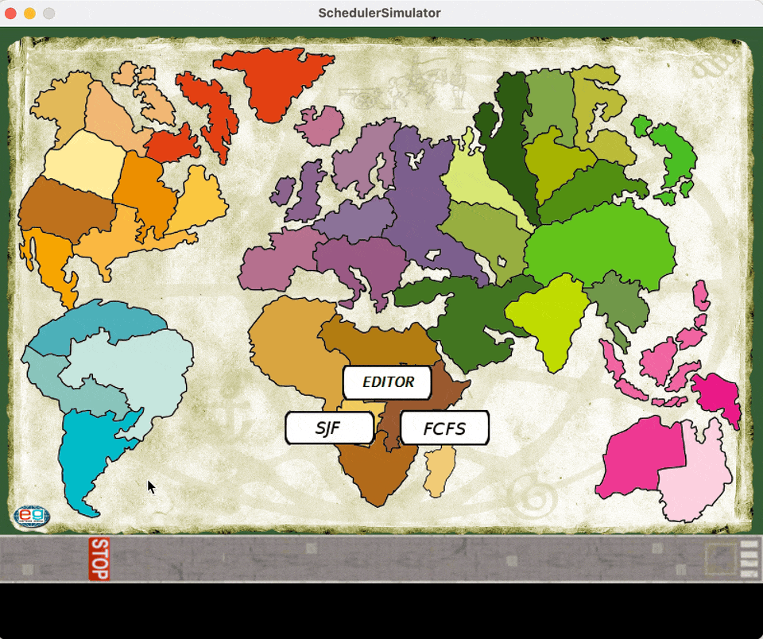

# Scheduler Simulator

This project is a simulation of job scheduling algorithms Shortest Job First (SJF) and First-Come, First-Served (FCFS) written in Processing.

## Requirements

To run and build the code, you will need to have the following software installed:

- Processing 3 or later: Download and install Processing from the official website https://processing.org/download/.

## How to Run

To run the game, follow these steps:

1. Download the source code from the project's GitHub repository: https://github.com/delco97/scheduler-simulator.
2. Open the `SchedulerSimulator.pde` file in Processing.
3. Click the "Run" button in the Processing IDE.

## How to Build

To build the game as an executable file that can be run on other machines, follow these steps:

1. Open the `SchedulerSimulator.pde` file in Processing.
2. Click the "File" menu and select "Export".
3. Choose the appropriate export settings for your target platform (Windows, Mac, or Linux).
4. Click the "Export" button.
5. The executable file will be saved to the chosen location on your computer.

## How to Install Missing Libraries

If the game fails to run due to missing libraries, you can install them by following these steps:

1. Open the Processing IDE.
2. Click the "Sketch" menu and select "Import Library".
3. Search for the missing library in the "Libraries" tab.
4. Click the "Install" button next to the library.
5. The library will be installed and you can now run the game.

## How to Play

The player controls the snake using the arrow keys on their keyboard. The objective is to catch apples that appear on the screen, possibly preferring to catch them in the right color order to get more points.

## Contributing

This project was created just for fun and experimenting with Processing, but if you want to contribute to it, feel free to fork the repository and make your changes. You can then submit a pull request with your changes for review.

## License

This project is licensed under the MIT License - see the `LICENSE` file for details.